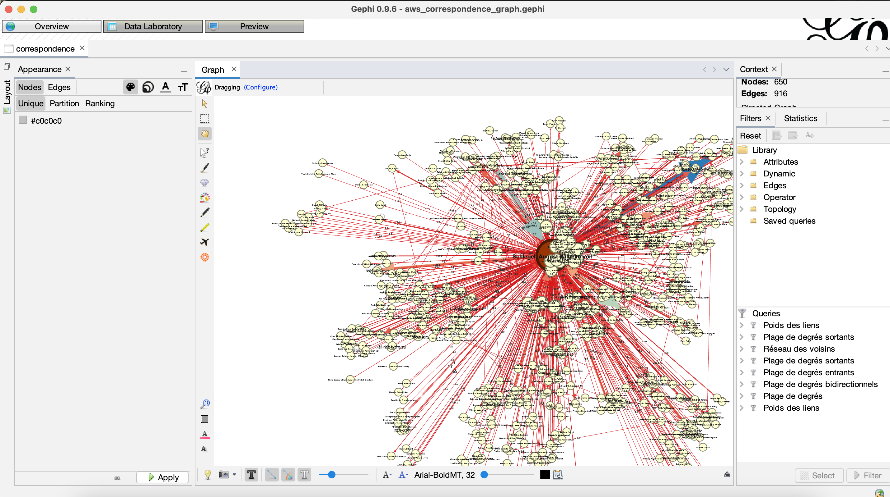
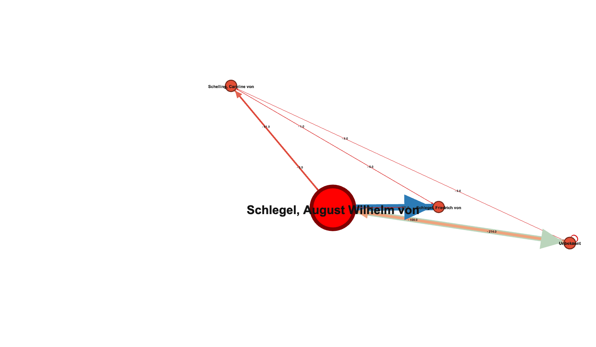

# Repository for the Term Paper about "Network and Sentiment Analyses on Selected Letters of the Schlegel"

This GitHub repository serves as a main collection of all scripts and digital resources for the term paper.
A [list](#packages-external) of all used external packages can be found in the corresponding section.
---------

## First steps

In order to be able to visualise the links between the people in the letter corpus, firstly,
I had to extract the needed metadata from the XML files and the [register.xml](data/register.xml) file.
For doing so, I used a [Jupyter Notebook](code/network_preps.ipynb) in which I implemented the functions for
metadata extraction and data enrichment. When extracting information about senders and receivers from
the letters, the algorithm already counts correspondence frequencies that can later be imported for the
graph visualisation. 

## Visualisation

For visualising the results (retrieved, also, with [network_preps.ipynb](./code/network_preps.ipynb)), I used the free open-source software [Gephi](https://gephi.org). Here, my first attempts
at storing the correspondence data were overthrown by the ID and labels sections Gephi has for data input.
Instead of using the GND keys I previously stored in the data, I opted to using the actual names of people from the
corpus to be able to use them as labels in the graph. 
To be frank, the first results were quite chaotic. After some adjustments and a "getting used to Gephi" time,
I achieved a decent output.

## Sentiment Analysis
For the sentiment analysis, I created the notebook [sentiment_analysis.ipynb](./code/sentiment_analysis.ipynb) in which 
I implemented both the short preprocessing of the texts and their extraction as well as
the actual analysis with [textblob-de](https://textblob-de.readthedocs.io/en/latest/). Further information can be taken
from the comments inside the code or the term paper file.

## Packages (external):

The external packages and modules I used in the creation of this term paper are the following:

- [lxml 4.8.0](https://lxml.de)
- [numpy 1.22.3](https://numpy.org/doc/stable/)
- [pandas 1.4.2](https://pandas.pydata.org)
- [spaCy 3.3.1](https://spacy.io)
- [textblob-de	0.4.3](https://textblob-de.readthedocs.io/en/latest/)
