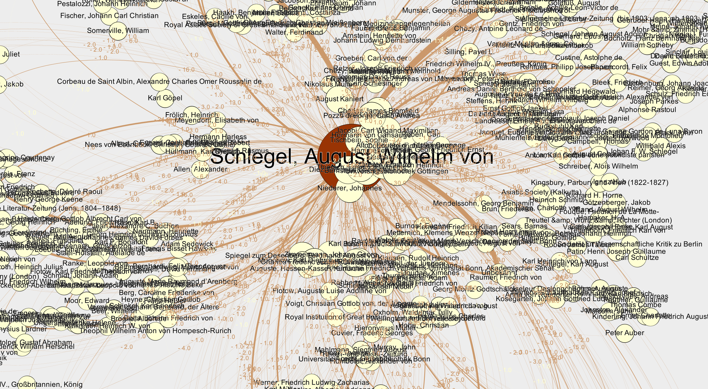

# Repository for the Term Paper about "Network and Sentiment Analyses on Selected Letters of the Schlegel"

This GitHub repository serves as a main collection of all scripts and digital resources for the term paper.

---------

### First steps

In order to be able to visualise the links between the people in the letter corpus, firstly,
I had to extract the needed metadata from the XML files and the [register.xml](data/register.xml) file.
For doing so, I used a [Jupyter Notebook](code/preprocessing.ipynb) in which I implemented the functions for
metadata extraction and data enrichment. When extracting information about senders and receivers from
the letters, the algorithm already counts correspondence frequencies that can later be imported for the
graph visualisation. 

### Visualisation

For visualising the results, I used the free open-source software [Gephi](https://gephi.org). Here, my first attempts
at storing the correspondence data were overthrown by the ID and labels sections Gephi has for data input.
Instead of using the GND keys I previously stored in the data, I opted to using the actual names of people from the
corpus to be able to use them as labels in the graph. 
To be frank, the first results were quite chaotic. After some adjustments and a "getting used to Gephi" time,
I achieved a decent output.

